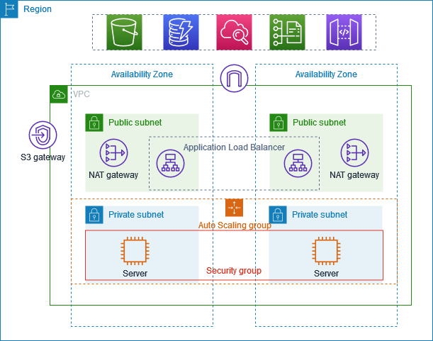

# AWS Project: Application Load Balancer with Private EC2 Instances

## 📌 Overview
This project demonstrates deploying an application in a secure AWS VPC environment.  
The setup ensures that EC2 instances remain in **private subnets** (not directly accessible from the internet), while an **Application Load Balancer (ALB)** makes the application available publicly.  

Traffic routing is controlled by the ALB using **path-based rules** so different EC2 instances can serve different content.

---

## 🏗️ Architecture

### Key Points:
- **Public Subnets**: Contain the Bastion host and NAT Gateway.
- **Private Subnets**: Contain the application EC2 instances (not directly accessible from the internet).
- **Bastion Host**: Used to securely SSH into EC2 instances in private subnets.
- **NAT Gateway**: Allows private instances to download updates from the internet.
- **Application Load Balancer**: Publicly accessible, forwards requests to private EC2 instances.
- **Path-based Routing**:  
  - `/a` → forwards traffic to **EC2a**  
  - `/b` → forwards traffic to **EC2b**

---

## ⚙️ AWS Services Used
- **VPC** with public and private subnets across multiple Availability Zones
- **EC2** instances (running Python `http.server` on port 8000)
- **Security Groups** for controlled access
- **Bastion Host** for SSH access
- **NAT Gateway**
- **Application Load Balancer**
- **Target Groups & Listener Rules**

---

## 🚀 How It Works
1. A **Bastion host** is launched in the public subnet to allow SSH access to private EC2 instances.
2. Two **EC2 instances** are launched in private subnets.  
   - Each runs a simple web server (`python3 -m http.server 8000`) with different HTML content.
3. Two **Target Groups** are created:
   - TG-EC2a → contains EC2a
   - TG-EC2b → contains EC2b
4. The **ALB Listener (port 80)** is configured with path rules:
   - `/a*` → forwards to TG-EC2a
   - `/b*` → forwards to TG-EC2b
5. Users access the app via the ALB’s public DNS:
   - `http://<ALB-DNS>/a` → shows EC2a content
   - `http://<ALB-DNS>/b` → shows EC2b content

---

## 📝 Setup Instructions
### 1. Networking
- Create a **VPC** with 2 public and 2 private subnets (across AZs).
- Attach an **Internet Gateway** to the VPC.
- Add a **NAT Gateway** in a public subnet.

### 2. Bastion Host
- Launch an EC2 instance in a public subnet.
- Allow SSH from your IP in its security group.
- Use this Bastion to connect to private EC2 instances.

### 3. Application Servers
- Launch EC2a and EC2b in private subnets.
- SSH into them via Bastion host.
- Install a simple app, e.g.:
  ```bash
  echo "Hello from EC2a" > index.html
  python3 -m http.server 8000
